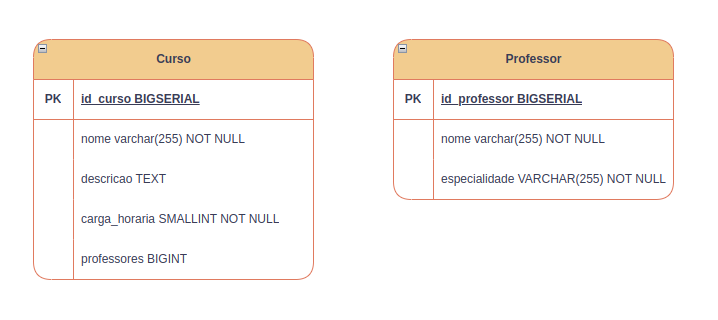
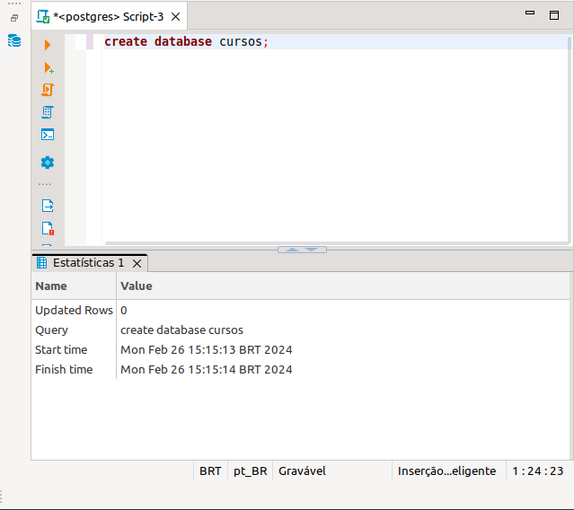
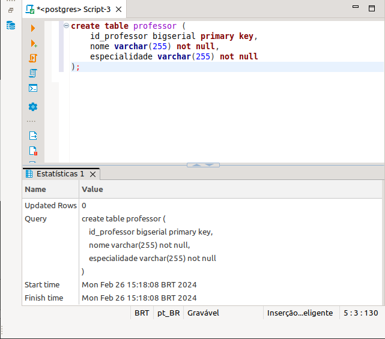
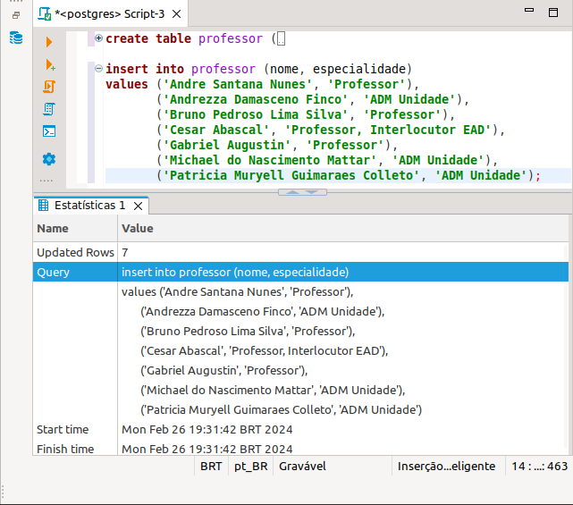
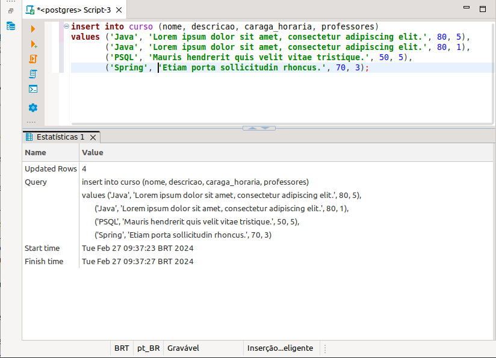

**_Exercicio Semana 7 Módulo 1 FMT_**

## [M1S7] Ex 1 - Modelagem

### Descrição

Modelar tabelas "curso" e "professor"

1. Tabela curso deve conter ao menos:
- Colunas:
  - ID
  - Nome
  - Descrição
  - Professores
  - Carga Horária

2. Tabela professor deve conter ao menos:
- Colunas:
    - ID
    - Nome
    - Especialidade

### Resultado

    

## [M1S7] Ex 2 - DDL (Professor)

### Descrição

Com a modelagem pronta, vamos para o banco de dados.
Crie *DDl* para a tabela "_professor_" conforme sua modelagem

## Resultado 

Aplicativo usado DBeaver.

- Criar Banco de Dados "cursos"

  

- DDL tabela professor

  

## [M1S7] Ex 3 - DML (Professor)

### Descrição

Tabela criada! Estão faltando seus dados. 
Crie ao menos 5 comandos 'insert' para a tabela _professor_ com dados diferentes.

## Resultado

  

## [M1S7] Ex 4 - DDL (Curso)

### Descrição 

Após criar sua primeira tabela a segunda é sempre mais fácil
Crie *DDL* para a tabela _curso_ conforme sua modelagem

## Resultado

  

## [M1S7] Ex 5 - DML (Curso)

### Descrição

O próximopasso são os dados!
Crie ao menos 3 comandos _insert_ para a tabela _curso_ cm dados diferentes

## Resultado

